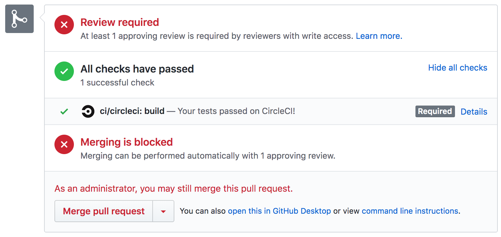

# NCPI Project Forge FHIR Model

🔥The FHIR model developed in Project Forge

## FHIR 101 - A Practical Guide

If you have never heard of FHIR, are unfamiliar with how to implement FHIR,
or are confused by any of the terms in this README, then
checkout the [FHIR 101 Jupyter Notebook](https://github.com/ncpi-fhir/fhir-101).

## Quickstart

This repository contains:
1. NCPI Project Forge FHIR Data Model - the conformance and example resource files
2. NCPI Project Forge Data Model Docs Site - The HTML/CSS/JavaScript files needed to
   generate a Jekyll documentation site for the model. This is also known as
   a `FHIR Implementation Guide` (IG).
3. Integration tests that test the data model

### Installation
1. Git clone this repository

```bash
$ git clone git@github.com:ncpi-fhir/ncpi-model-forge.git
$ cd ncpi-model-forge
```

2. Setup a Python virtual environment

```bash
# Create virtualenv
$ python3 -m venv venv

# Activate virtualenv
$ source ./venv/bin/activate
```

3. Install the necessary requirements

```bash
$ pip install -e .
```
Test the installation by running the CLI: `fhirutil -h`. You should see
something that contains:
```
Usage: fhirutil [OPTIONS] COMMAND [ARGS]...

  A CLI utility for validating FHIR Profiles and Resources
```

4. Install Docker CE: https://docs.docker.com/install/

Docker is needed because the fhirutil CLI executes the model validation
inside a Dockerized version of the HL7 IG Publisher.

### Run Validations
The resource files that make up the FHIR data model are enclosed inside the
resources subdirectory: `./site_root/input/resources`.

1. Add a new conformance resource

    `./site_root/input/resources/profiles/<resource file>`

2. Add a new example resource to test the conformance resource

    `./site_root/input/resources/examples`

3. Validate the models

   ```shell
   # Method 1 - Uses the dockerized IG publisher
   fhirutil validate ./site_root/ig.ini --publisher_opts='-tx n/a'

   # Method 2 - Uses native IG publisher - faster than above method
   fhirutil add ./site_root/input/resources
   java -jar org.hl7.fhir.publisher.jar -ig site_root/ig.ini -tx n/a
   ```

   See [Installing the IG Publisher](#Validate-the-Model) if using method 2.

## Develop
This repository provides a process for working through the
[FHIR model development](https://hub-binder.mybinder.ovh/user/fhir-sci-fhir-101-hk2fpjkz/notebooks/FHIR%20101%20-%20Practical%20Guide.ipynb#Model-Development) and
[documentation process](https://hub-binder.mybinder.ovh/user/fhir-sci-fhir-101-hk2fpjkz/notebooks/FHIR%20101%20-%20Practical%20Guide.ipynb#Model-Documentation).


### Naming Conventions
All resource files in the model will follow the naming convention: `<resource type>-<resource id>.json`
Please see the NCPI Project Forge [naming conventions doc](https://github.com/ncpi-fhir/ncpi-model-forge/tree/master/docs/naming_conventions.md) for details.

### Repository Layout

- Source files for IG: `site_root`

```
site_root
├── ig.ini                                     -> IG configuration file
├── input
│   ├── ImplementationGuide-KidsFirst.json     -> IG resource file
│   └── resources
│       ├── examples                           -> Example resources
│       ├── extensions                         -> Extensions
│       ├── profiles                           -> StructureDefinition (non-Extension)
│       ├── search                             -> SearchParameters
│       └── terminology                        -> CodeSystems, ValueSets
```

### ImplementationGuide Files
The files `ig.ini` and `ImplementationGuide-KidsFirst.json` contain
configuration information for the IG and affect which resources are validated
and included in the generated site.
Read more about them [here](https://build.fhir.org/ig/FHIR/ig-guidance/index.html)
and [here](http://www.hl7.org/fhir/implementationguide.html)

### Conformance Resources
You can use any tool to develop a conformance resource (Forge, cimpl, etc.),
but for example purposes just create a JSON file in the conformance resource
directory:

 `./site_root/input/resources/profiles/StructureDefinition-study.json`

with the following content:
```json
{
    "resourceType": "StructureDefinition",
    "id": "study",
    "url": "http://fhir.ncpi-fhir.io/StructureDefinition/study",
    "version": "0.1.0",
    "name": "Study",
    "title": "Study",
    "status": "draft",
    "publisher": "NCPI Project Forge",
    "description": "A research study within the NCPI Project Forge ecosystem",
    "fhirVersion": "4.0.0",
    "kind": "resource",
    "abstract": false,
    "type": "ResearchStudy",
    "baseDefinition": "http://hl7.org/fhir/StructureDefinition/ResearchStudy",
    "derivation": "constraint",
    "differential": {
        "element": [
            {
                "id": "ResearchStudy",
                "path": "ResearchStudy"
            },
            {
                "id": "ResearchStudy.phase",
                "path": "ResearchStudy.phase",
                "max": "0"
            },
            {
                "id": "ResearchStudy.arm",
                "path": "ResearchStudy.arm",
                "max": "0"
            }
        ]
    }
}
```

### Example Resources
Next create an example resource in the example resources directory:

`./site_root/input/resources/examples/ResearchStudy-sd-001.json`

with the following content:

```json
{
    "resourceType":"ResearchStudy",
    "id": "sd-001",
    "meta": {
        "profile": ["http://fhir.ncpi-fhir.io/StructureDefinition/study"]
    },
    "status": "completed",
    "title": "Study of Ewing's Sarcoma"
}
```
### Validate the Model
To validate the resources you just created:

```shell
# Method 1 - Uses the dockerized IG publisher
fhirutil validate ./site_root/ig.ini --publisher_opts='-tx n/a'

# Method 2 - Uses native IG publisher - faster than above method
fhirutil add ./site_root/input/resources
java -jar org.hl7.fhir.publisher.jar -ig site_root/ig.ini -tx n/a
```

### Installing the IG Publisher
Since Method 1 above uses the Dockerized version of the HL7 IG publisher jar
it takes longer than running the jar on your local machine. Developers don't
necessarily have to use Method 1 as it is primarily for the CircleCI pipeline.

In order to run validation using Method 2 which runs the publisher jar
on your machine, you will need to install the dependencies (Java, Jekyll).

See [IG publisher installation instructions](https://confluence.hl7.org/display/FHIR/IG+Publisher+Documentation#IGPublisherDocumentation-Installing).

### Validation Results
The CLI will log output to the screen and tell you whether validation succeeded
or failed. You can view detailed validation results at `./site_root/output/qa.html`

### Pull Requests
You should already have a local git branch (e.g. add-biospecimen-profiles-resources)
that you've been periodically committing to and pushing up to Github. At this point
you're ready to get your code merged into the master branch of the git repository.  

Go ahead and make a Pull Request on Github to merge your feature branch into
the master branch. If you're not quite ready for it to be reviewed, you can
make it a [Draft Pull Request](https://help.github.com/en/articles/about-pull-requests#draft-pull-requests).

Once all status checks have passed, request review(s) from other
model developers. You need at least 1 approving review to merge your PR.

### Continuous Integration
Notice the status checks section of the Pull Request:
<p align="center">
  
</p>

Every pull request must pass all of the status checks before it is eligible for
merging. For this repository there is only one status check: every time you
push a commit, the continuous integration that has been setup runs conformance resource and
resource validation for the model using the same Python CLI tool you've been using.

We use CircleCI for our CI solution.
If you click on the "Details" link next to `ci/circleci: build` text, you can
see a more detailed view of the CI output on CircleCI.
